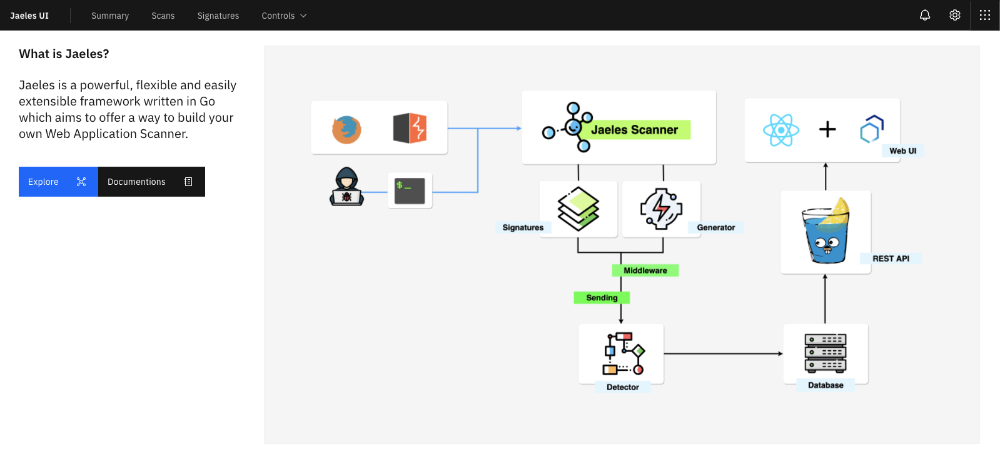
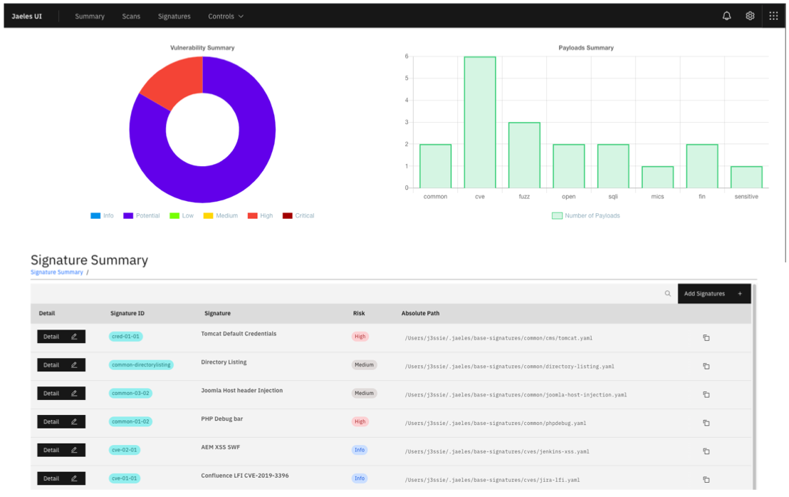
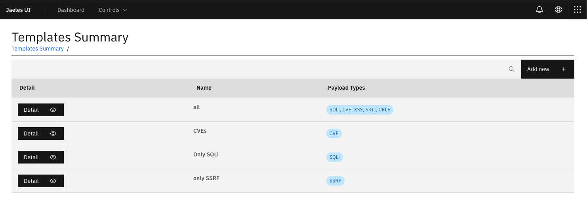
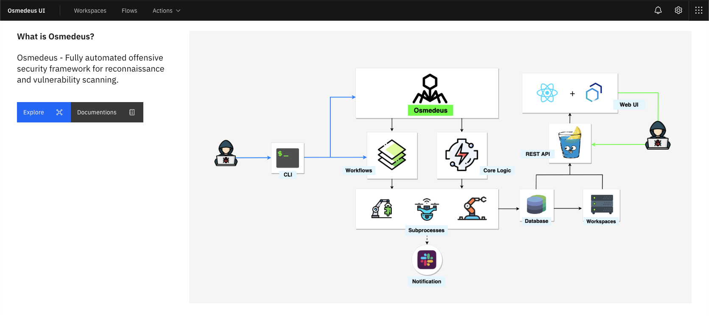
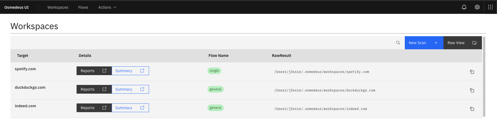
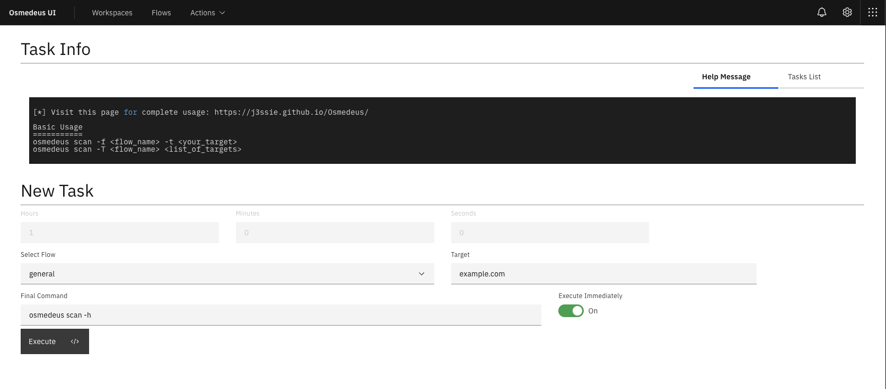

UI
===========
Web UI for my tools.

***

## [Jaeles](https://github.com/jaeles-project/jaeles)







***
## [Osmedeus](https://github.com/j3ssie/osmedeus)








***

## Installation
```
yarn install
npm start
```


## Credits
* React components is powered by [Carbon](https://www.carbondesignsystem.com/) and [carbon-tutorial](https://github.com/carbon-design-system/carbon-tutorial).

* Awesomes artworks are powered by [Freepik](http://freepik.com) at [flaticon.com](http://flaticon.com).
