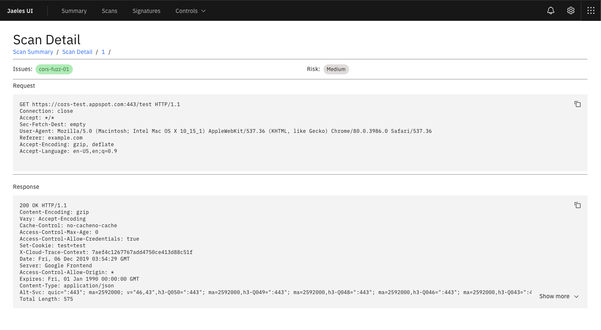

UI
===========
Web UI for my tools.


***

## [Jaeles](https://github.com/j3ssie/Jaeles)





## Installation
```
yarn install
npm start
```


## Credits
* React components is powered by [Carbon](https://www.carbondesignsystem.com/) and [carbon-tutorial](https://github.com/carbon-design-system/carbon-tutorial).

* Awesomes artworks are powered by [Freepik](http://freepik.com) at [flaticon.com](http://flaticon.com).
